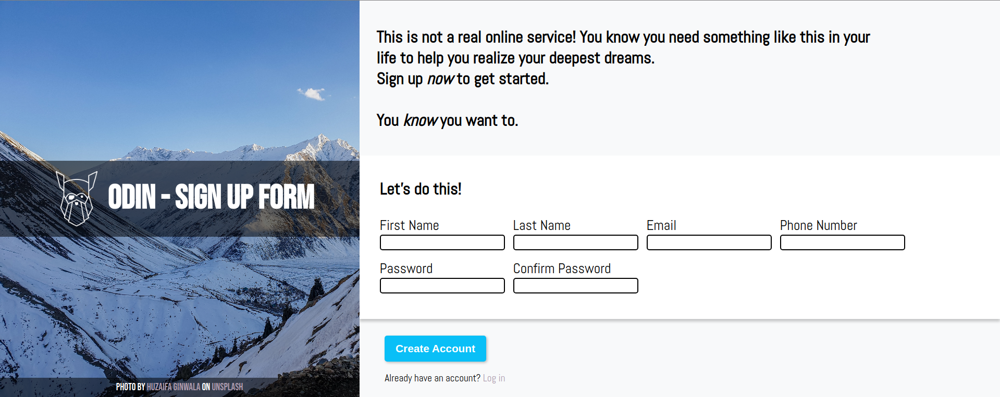

# Sign Up Form

## Links
- [Try My Sign-Up Form here!!](https://georgan1987.github.io/Sign-Up-Form/)
- [Link to the Assignment](https://www.theodinproject.com/lessons/node-path-intermediate-html-and-css-sign-up-form)

## About
Sign-Up Form is the first project for the ***FullStack JavaScript module*** on The Odin Project. 

This mock sign-up form is a mobile-friendly modern layout built using CSS flexbox. 

Form validation is done using Vanilla JavaScript, each input is being checked by validation rules, and shows a relevant error message in case our inputs are not compliant with the rules.

## Built in
* HTML
* CSS (Flexbox)
* Javascript